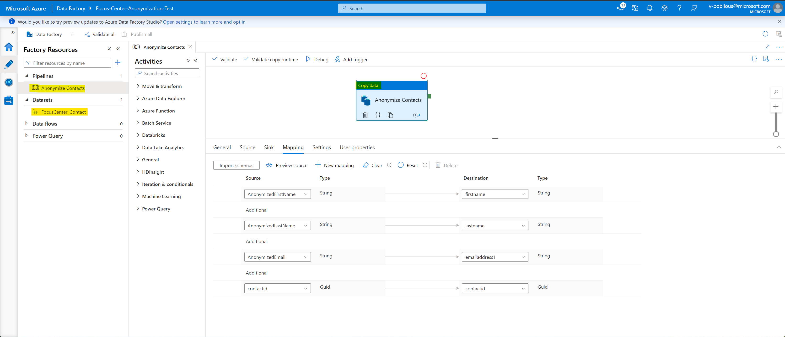
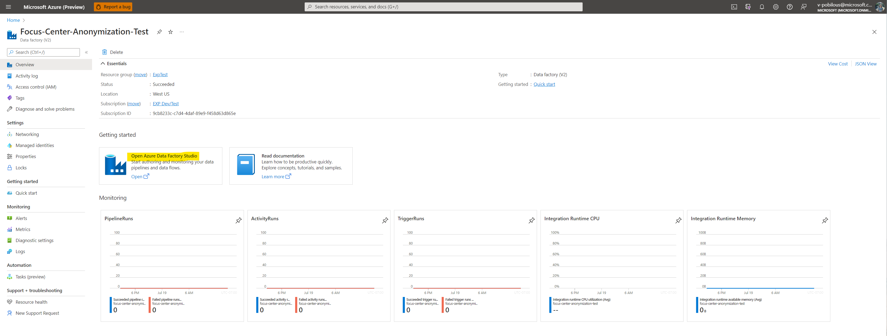
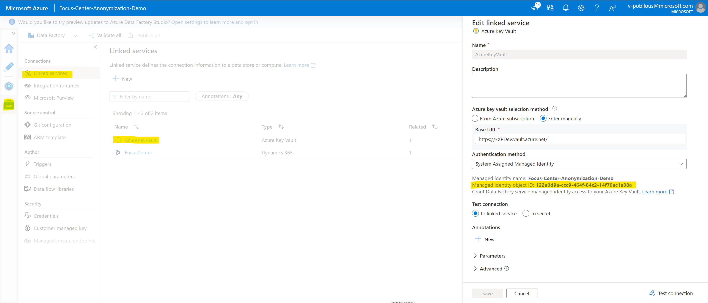
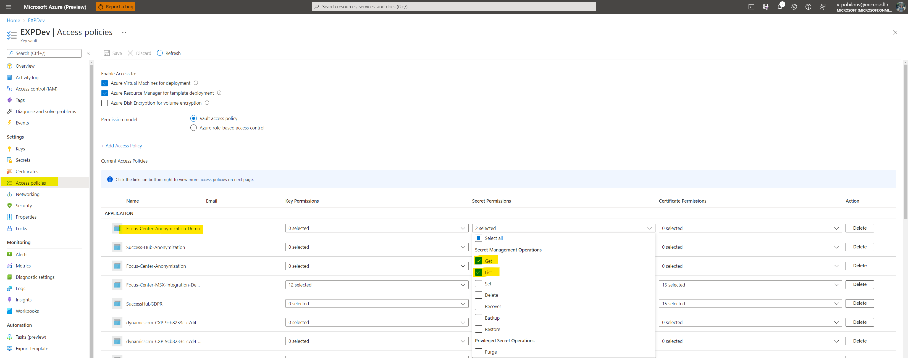
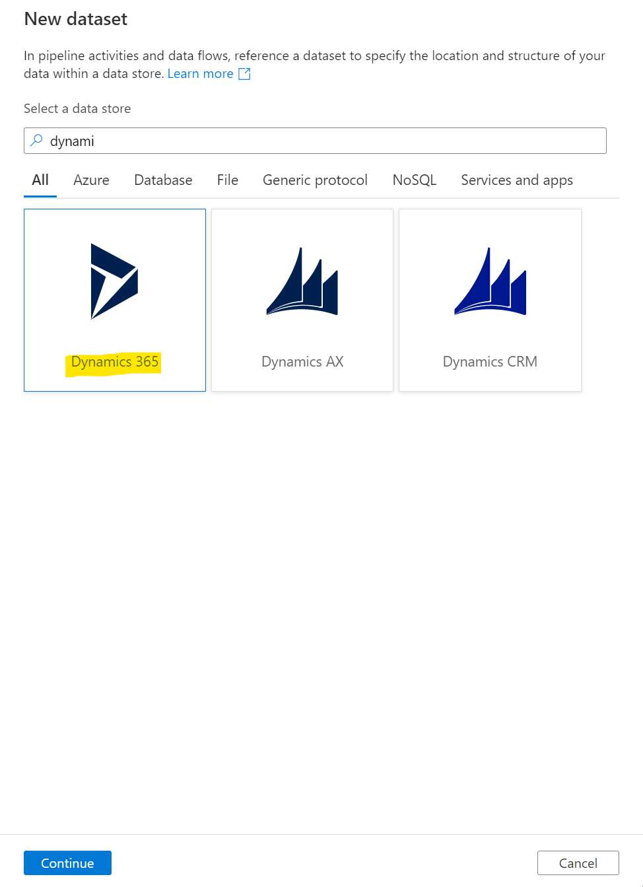
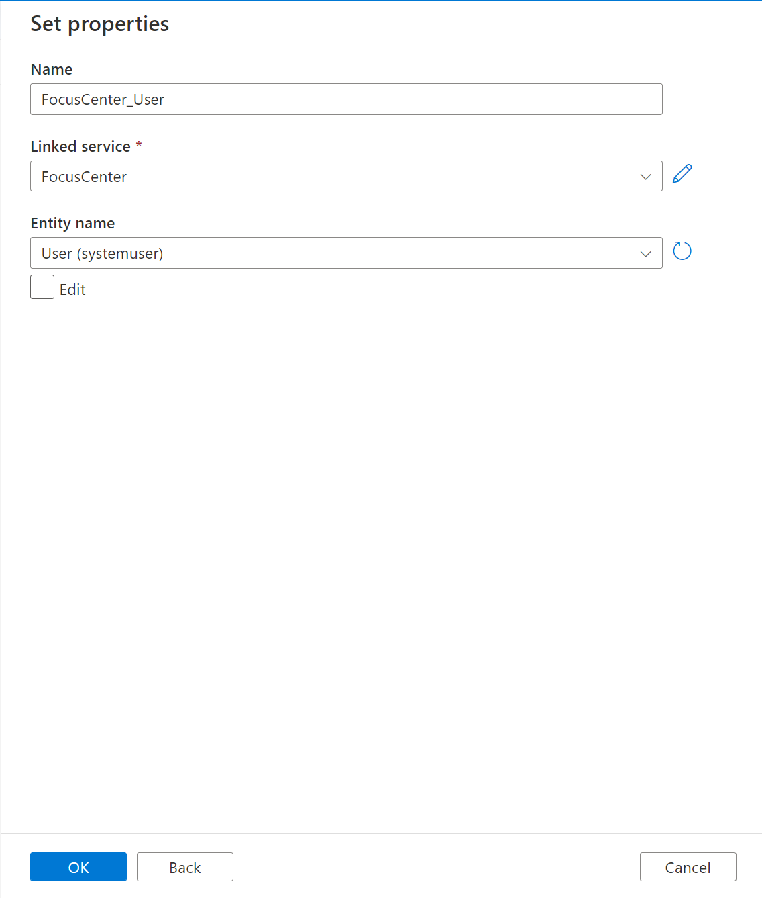
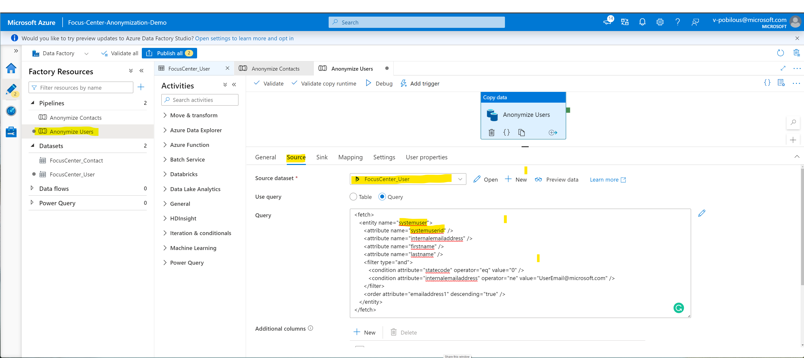
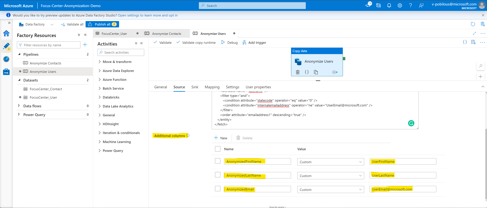
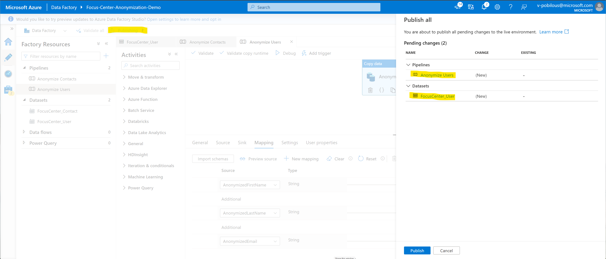

# Contents

[Introduction]

[Components and Functionality]

[Pre-requisites]

[Configuration and Setup]

[Extension]

# Introduction

Often there is a need to copy Production org into a sandbox org for development purposes. It is recommended that the personal identifiable information is anonymized before the sandbox is used by the developers. The Focus Center Anonymization is a simple Azure Data Factory that anonymizes (rename/change data into non-identifiable) records for the Dataverse tables.

# Components and functionality

**Components**

Focus Center Anonymization ADF consists of:

-   Datasets (Dataverse tables)

-   Anonymization pipeline with Copy Data activities to anonymize data

-   Azure Key Vault Linked Service to access Azure Key Vault

-   Dynamics 365 Linked Service to access Dynamics 365 environment

**Functionality**

-   Anonymize table records fields with static values based on the FecthXML query provided in the source

# Pre-requisites

-   Azure subscription to deploy Azure Data Factory.

-   App Registration (application user) to access Dynamics 365 environment. For more information, see [Create an application user](https://docs.microsoft.com/en-us/power-platform/admin/manage-application-users#create-an-application-user).

-   Azure Key Vault secret to store App Registration secret. For more information, see [Add a secret to Key Vault](https://docs.microsoft.com/en-us/azure/key-vault/secrets/quick-create-portal#add-a-secret-to-key-vault).

-   Basic knowledge of Azure Data Factories to extend/modify by default functionality.

# Configuration and Setup

In order to use Focus Center Anonymization ADF the below steps need to be performed.

1.  Open FocusCenterAnonymizationADF.sln solution in the Visual Studio.

2.  Go to the ARMTemplateParametersForFactory.json and update the parameters below with your values:

    a.  **factoryName**: Data Factory name

    b.  **envServicePrincipalId**: App Registration's Client Id of application user to access Dynamics 365 environment

    c.  **keyVaultUrl**: Url to Azure Key Vault where App Registration's secret is stored.

    d.  **keyVaultSecretName**: Name of Azure Key Vault secret where App Registration's secret is stored.

    e.  **envUrl**: Dynamics 365 environment url.

    f.  **dataFactory_location**: Location to deploy Data Factory (e.g., westus).

3.  Right click on the "Pipelines", select Deploy -\> New and fill in the below details:

    a.  **Subscription:** select needed subscription from the list

    b.  **Resource group:** select needed resource group from the list

    c.  **Deployment template**: focus center anonymization\\armtemplateforfactory.json

    d.  **Template parameters file:** focus center anonymization\\armtemplateparametersforfactory.json

4.  Click "Deploy".

5.  Once Data Factory is deployed, you will see below message in Visual Studio output.\
    

6.  By default, Data Factory does not have access to the Key Vault. Perform the steps below to provide access:

    a.  Open Data Factory in the Azure Data Factory studio:\
        

    b.  Navigate to Manage -\> Linked services -\> AzureKeyVault and get Managed identity object ID:\
        

    c.  Navigate to your Key Vault -\> Access policies and add new Access policy for ADF with read secrets permission.\
        \
        

# Extension

By default, Focus Center Anonymization ADF performs anonymization of firstname, lastname and emailaddress1 attributes of Contact table. Data Factory can be extended to anonymize different attributes/tables. In order to add a new table to anonymize you can follow the steps below:

1.  Open Data Factory in the Azure Data Factory studio.

2.  Navigate to Author -\> Datasets and select "New Dataset".

3.  In the opened pop-up select "Dynamics 365", input you dataset name, select "FocusCenter" for Linked service and select needed table.\
    \
     
    

4.  Once new Dataset created, navigate to the Pipelines, clone existing pipeline and rename it.

5.  Select Copy Data activity and rename it if needed.

6.  In the Copy Data activity, go to "Source" section, update Source dataset to newly created dataset and update FetchXML query (attributes that you want to anonymize must be present in the FetchXML query).\
    

7.  Add new values for attributes you want to anonymize as Additional columns in Source section to be used later in the mapping.\
    

8.  Navigate to "Sink" section in the Copy Data activity and update Sink dataset with newly created dataset.

9.  Navigate to "Mapping" section in the Copy Data activity, click "Import schemas" to load new table schema and update mapping to map anonymized attributes to table attributes. **Do not forget to add identifier mapping so that records can be updated based on it.**
    

10. Publish Data Factory.\
    

  [Introduction]: #introduction
  [Components and functionality]: #components-and-functionality
  [Pre-requisites]: #pre-requisites
  [Configuration and Setup]: #configuration-and-setup
  [Extension]: #extension
