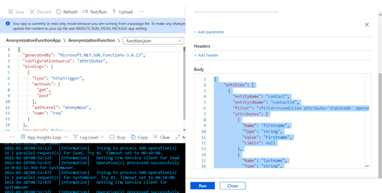

# Contents

[Introduction]

[Components and Functionality]

[Pre-requisites]

[Configuration and Setup]

[Performance Considerations]

# Introduction

Often there is a need to copy Production org into a sandbox org for development and/or testing purposes. Once copied onto a sandbox org, it is recommended that the personal identifiable information be anonymized before the team starts working with it. The Focus Center Anonymization Function is an Azure Function that anonymizes records for specified Dataverse tables.

# Components and Functionality

**Components**

Focus Center Anonymization Function is an AnonymizationFunctionApp Function App that has one function in it - AnonymizationFunction.

**Functionality**

-   Anonymize table records fields with static/dynamics values provided based on the FecthXML query provided in the configuration JSON

# Pre-requisites

1.  Create a Function App using App Service Plan. To create Function App review this [link](https://docs.microsoft.com/en-us/azure/azure-functions/functions-create-function-app-portal).

2.  Create App Registration (application user) to access Dynamics 365  environment. For more information, see [Create an application user](https://docs.microsoft.com/en-us/power-platform/admin/manage-application-users#create-an-application-user).

3.  Create Azure Key Vault secret to store App Registration secret. For more information, see [Add a secret to Key Vault](https://docs.microsoft.com/en-us/azure/key-vault/secrets/quick-create-portal#add-a-secret-to-key-vault).

# Configuration and Setup

In order to use Focus Center Anonymization Function the below steps need to be performed.

1.  Deploy function app using Visual Studio. For more information, see this [link](https://docs.microsoft.com/en-us/azure/azure-functions/functions-develop-vs?tabs=in-process#publish-to-azure).

2.  Create following application settings for deployed Function App.

  | Application Setting        | Description                                  |
  | ---------------------------| -------------------------------------------- |
  | CrmUrl                     | Provide organization URL. (ex: https://scsdevhubenv2.crm.dynamics.com) |
  | CrmAppClientId             | Provide Client ID of the application user which is created during pre-requisite steps |
  | CrmAppClientSecret         | Provide Azure Key Value secret URL, where App Registration (application user) secret is stored. |
  | CrmMaxParallelConnections  | Provide a number of parallel connections to the Dataverse. |
  | CrmMaxRequestsCountInBulk  | Provide a maximum number of requests to be sent to Dataverse in one batch. |

3.  Trigger Focus Center Anonymization Function using HTTP trigger and
    provide configuration JSON in the request body. See example of
    configuration JSON below:
```json
    {
    "entities": [
        {
            "entityName": "contact",
            "entityIdName": "contactid",
            "filter": "<filter><condition attribute='statecode' operator='eq' value='0' /> </filter>",
            "attributes": [
                {
                    "Name": "firstname",
                    "Type": "string",
                    "Counter": true,
                    "Value": "First_name",
                    "Limits": null
                },
                {
                    "Name": "lastname",
                    "Type": "string",
                    "Counter": true,
                    "Value": "Last_name",
                    "Limits": null
                },
                {
                    "Name": "emailaddress1",
                    "Type": "email",
                    "Counter": false,
                    "Value": "FocusCenter_contact@microsoft.com",
                    "Limits": null
                }
            ]
        },
        {
            "entityName": "lead",
            "entityIdName": "leadid",
            "filter": "<filter><condition attribute='statecode'operator='eq' value='0' /></filter>",
            "attributes": [
                {
                    "Name": "firstname",
                    "Type": "string",
                    "Counter": true,
                    "Value": "First_name",
                    "Limits": null
                },
                {
                    "Name": "lastname",
                    "Type": "string",
                    "Counter": true,
                    "Value": "Last_name",
                    "Limits": null
                },
                {
                    "Name": "emailaddress1",
                    "Type": "email",
                    "Counter": false,
                    "Value": " FocusCenter_leads@microsoft.com",
                    "Limits": null
                }
            ]
        },
        {
            "entityName": "systemuser",
            "entityIdName": "systemuserid",
            "filter": "<filter><condition attribute='isdisabled'operator='eq' value='0' /></filter>",
            "attributes": [
                {
                    "Name": "firstname",
                    "Type": "string",
                    "Counter": true,
                    "Value": "First_name",
                    "Limits": null
                },
                {
                    "Name": "lastname",
                    "Type": "string",
                    "Counter": true,
                    "Value": "Last_name",
                    "Limits": null
                },
                {
                    "Name": "internalemailaddress",
                    "Type": "email",
                    "Counter": false,
                    "Value": " FocusCenter_users@microsoft.com",
                    "Limits": null
                }
            ]
        }
    ]
}
```

Description of configuration JSON attributes:

  | Json Attribute Name | Description                                          |
  | ------------------  | ---------------------------------------------------- |
  | entities          | Multiple entities set |
  | entityName        | Single entity schema name |
  | entityIdName      | Single entity primary Id schema name |
  | filter            | Entity record Filter conditions. With filters you can add multiple conditions as well as we can exclude records which we don't want to anonymize. |
  | attributes        | Entity multiple field schema name set |
  | Name              | Schema name of fields |
  | Type              | Field data type |
  | Counter           | Counter suffix added at record if true (for ex: firstname1, firstname2, etc.) else no suffix will add if false. |
  | Value             | Value of field |
  | Limits            | Max limit of record by default value is null. |



# Performance considerations

Please find performance consideration below.

1)  Azure function performance depends on your App Service plan. Plans with more ACU can give you a better performance. If you need to anonymize large amounts of data and hit memory limit in Azure Function (notification banner will appear in Azure Portal if this happens), you need to scale up App Service plan.

2)  CRMMaxParellalConnection and CrmMaxRequestsCountInBulk application settings should be tried out with a couple of combinations to get the best performance out of the environment.

3)  Please ensure that no other jobs/flows/etc. are running with the same account to avoid affecting Azure Function performance.

4)  If you notice that function hangs (does not complete with failed/succeeded status and not updating any records for some time), then there is high likelihood that API calls to the Dataverse have been throttled for this user. To understand more about api limits look into [this link](https://docs.microsoft.com/en-us/power-apps/developer/data-platform/api-limits).

5)  Parallelism may begin with 5 threads and can be scaled up/down based on the function performance.

6)  Small batch sizes are recommended. Batch size may begin with 200 and can be scaled up/down based on the function performance.

7)  Performance can be impacted by the number of synchronous components configured on the target entity.

  [Introduction]: #introduction
  [Components and functionality]: #components-and-functionality
  [Pre-requisites]: #pre-requisites
  [Configuration and Setup]: #configuration-and-setup
  [Performance Considerations]: #performance-considerations